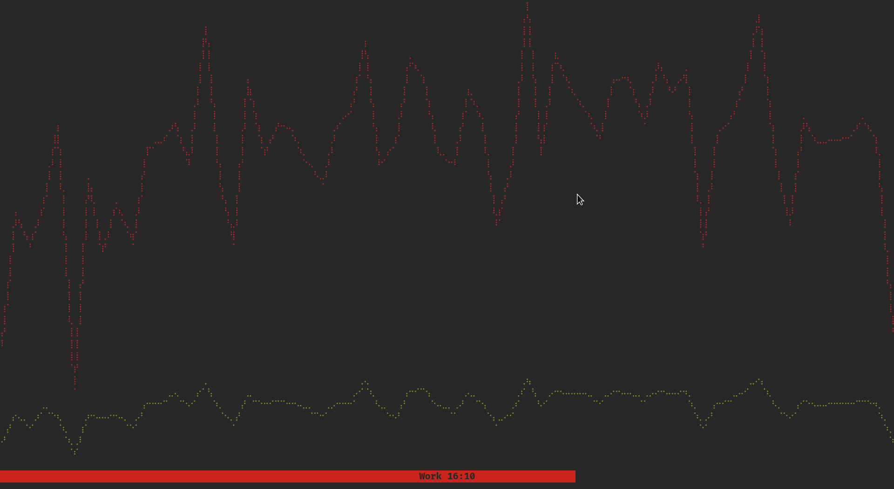

# fitimer

A timer to keep fit and healthy whilst having a sedentary work.

## Simplicity

You are either working or taking a break. So we have those two states in the real world. I used to use pomodoro timers for this, but this is simpler and has a nicer interface for me.



## How to install

```bash
$ cargo install fitimer
```

## Features

- desktop notifications
- customizable colors

## Configuration

Fitimer is configurable through a json file, here is the default config located at `$HOME/.config/fitimer/config.json`:

- Default colors use the `gruvbox` color pallete.
- Durations are in minutes
- tick rate (in milliseconds) means how frequent the app should get re-rendered (increase this to reduce CPU load)

```json
{
  "tick_rate": 1000,
  "durations": {
    "work": 25,
    "rest": 5
  },
  "color": {
    "black": "#282828",
    "white": "#fbf1c7",
    "gray": "#928374",
    "yellow": "#d79921",
    "green": "#98971a",
    "red": "#cc241d",
    "blue": "#458588",
    "purple": "#b16286",
    "aqua": "#689d6a",
    "orange": "#d65d0e"
  }
}
```

## Todo

- [x] setup tui
- [x] add timer state
- [x] toggle timer
- [x] change timer state between work and rest
- [x] save progress into a file on toggle/change
- [x] make graph for statistics
- [x] add help menu for shortcuts
- [x] remove env vars and use json config file
- [x] remove option to configure date and move to static config
- [x] move the stat file into somewhere appropriate other than .config
- [-] change stat file format to use only date (no time) and use w & r instead of work & rest
- [ ] handle all errors and use Result<> instead
- [ ] add settings page?
- [ ] add option to disable graph (prevents setting into file too)
- [ ] add option to delete stat file content
